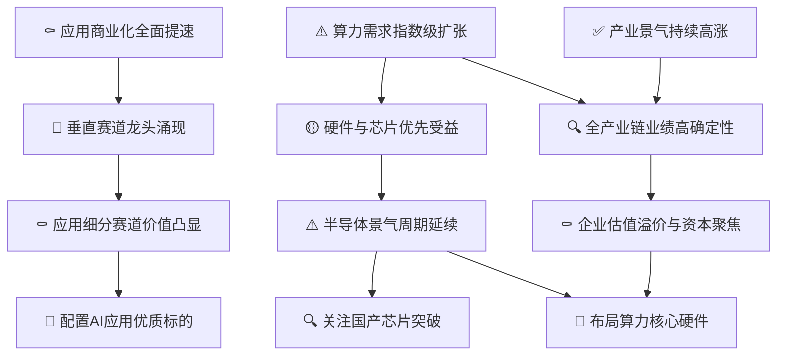

# 中国AI 50行业景气分析

> **综合评级: ✅ 景气** | 信号强度: 2.46 | 生成日期: 2026-07-08

## 推理链概览

## 📊 现状诊断

### ✅ 产业景气持续高涨

> **ID**: `H0-1` | 置信度: high
> ⏱️ 时间窗口: 当前

**陈述**: 中国AI产业景气持续高涨，2026年核心产业规模突破6800亿元，全球AI市场规模预计突破5000亿美元，多机构上调行业景气预期。

**推理链**: 因为情报[1][2][5]显示AI在医疗、金融、自动驾驶等领域需求爆发，且全球及中国政策、资本、产业规模同步扩张 → 所以产业景气持续高涨 → 导致全产业链业绩确定性增强、算力需求进一步扩张。

**跟踪指标**:
- 中国人工智能核心产业规模增速 (巡检: quarterly)
- 全球AI市场规模 (巡检: quarterly)

### ⚰️ 应用商业化全面提速

> **ID**: `H0-2` | 置信度: high
> ⏱️ 时间窗口: 当前

**陈述**: AI应用商业化全面提速，C端AI应用Q3营收增速达34.9%，医疗AI诊断准确率超95%，金融风控效率提升70%，多赛道进入规模落地阶段。

**推理链**: 因为情报[1][2][16]显示AI从技术研发转向规模商用，C端和B端应用营收加速增长，多个垂直场景ROI清晰 → 所以应用商业化全面提速 → 导致垂直赛道龙头涌现，投资逻辑从硬件向应用迁移。

**跟踪指标**:
- C端AI应用季度营收增速 (巡检: quarterly)
- AI应用公司毛利率 (巡检: quarterly)

### ⚠️ 算力需求指数级扩张

> **ID**: `H0-3` | 置信度: medium
> ⏱️ 时间窗口: 当前

**陈述**: 算力需求呈现指数级扩张，北美五大科技企业2025年AI资本开支同比大增64.55%，大模型Token调用量激增，全球AI基础设施投资预计2029年达12619亿美元。

**推理链**: 因为情报[5][8][9]显示大模型迭代、应用落地驱动算力需求爆发，云厂商资本开支持续高增长 → 所以算力需求指数级扩张 → 导致硬件与芯片环节优先受益，全产业链业绩确定性增强。

**跟踪指标**:
- 北美云厂商AI资本开支合计 (巡检: quarterly)
- 大模型Token调用量 (巡检: monthly)

## 🔮 一阶推演

### 🔍 全产业链业绩高确定性

> **ID**: `H1-1` | 置信度: low
> 上游: `H0-1` → `H0-3`
> ⏱️ 时间窗口: 当前

**陈述**: AI全产业链业绩高确定性，2025年申万计算机板块归母净利润同比增长57.42%，2026Q1继续加速，算力与应用双端验证业绩兑现。

**推理链**: 因为H0-1产业景气持续高涨，H0-3算力需求指数级扩张 → 所以从芯片到应用的全产业链公司收入利润均大幅提升，业绩确定性高 → 导致资本市场给予估值溢价，资金进一步聚焦AI赛道。

**跟踪指标**:
- 申万计算机板块归母净利润同比增速 (巡检: quarterly)
- AI应用公司经营现金流/营业收入 (巡检: quarterly)

### 🚫 垂直赛道龙头涌现

> **ID**: `H1-2` | 置信度: medium
> 上游: `H0-2`
> ⏱️ 时间窗口: 当前

**陈述**: 垂直赛道龙头涌现，医疗AI、金融科技、自动驾驶等领域出现一批技术领先、商业化初具规模的专精特新企业，多个企业进入福布斯中国AI TOP50细分榜单。

**推理链**: 因为H0-2应用商业化全面提速 → 在医疗、金融、自动驾驶等高价值垂直场景中，率先构建数据壁垒与用户粘性的企业成长为细分龙头 → 导致应用细分赛道投资价值凸显，吸引资本布局。

**跟踪指标**:
- 福布斯AI TOP50垂直赛道企业数量 (巡检: annual)
- 医疗AI等赛道头部企业付费客户数 (巡检: quarterly)

### 🟡 硬件与芯片优先受益

> **ID**: `H1-3` | 置信度: low
> 上游: `H0-3`
> ⏱️ 时间窗口: 当前

**陈述**: 硬件与芯片环节优先受益于算力需求扩张，AI半导体2025年销售额已占全球半导体总量的近三分之一，国产AI芯片预计2026年迎来放量。

**推理链**: 因为H0-3算力需求指数级扩张 → 上游处理器、HBM内存、网络组件等硬件及芯片最先获得订单增量，业绩弹性最大 → 导致半导体景气周期延续，国产替代进程加速。

**跟踪指标**:
- 全球半导体销售额同比增速 (巡检: monthly)
- 国产AI芯片出货量 (巡检: quarterly)

## ⚖️ 二阶推演（矛盾与拐点）

### ⚰️ 企业估值溢价与资本聚焦

> **ID**: `H2-1` | 置信度: high
> 上游: `H1-1`
> ⏱️ 时间窗口: 当前-2027Q1

**陈述**: 中国AI企业享受显著估值溢价，23%的中国科技50强企业AI研发投入占营收超50%，全球资本重新定价中国AI资产，资金持续向头部及高成长标的聚焦。

**推理链**: 因为H1-1全产业链业绩高确定性 → 资本市场给予AI企业更高的增长预期和估值倍数，资本向该赛道高度集中 → 导致算力核心硬件等资产价格维持高位，进一步支撑布局需求。

**跟踪指标**:
- AI板块市盈率(TTM) (巡检: daily)
- AI产业资本开支强度 (巡检: quarterly)

### ⚰️ 应用细分赛道价值凸显

> **ID**: `H2-2` | 置信度: high
> 上游: `H1-2`
> ⏱️ 时间窗口: 当前-2027Q1

**陈述**: AI应用细分赛道投资价值凸显，C端AI应用前三季度营收增速达34.9%，部分公司经营性现金流转正，垂直应用企业盈利能力持续改善。

**推理链**: 因为H1-2垂直赛道龙头涌现 → 在C端工具、金融科技、教育等细分领域已跑通商业模式的龙头展现出强成长性和现金流改善 → 导致应优先配置这些优质应用标的，分享商业化从0到1的红利。

**跟踪指标**:
- C端AI应用板块季度营收增速 (巡检: quarterly)
- AI应用企业毛利率与净利率 (巡检: quarterly)

### ⚠️ 半导体景气周期延续

> **ID**: `H2-3` | 置信度: medium
> 上游: `H1-3`
> ⏱️ 时间窗口: 当前-2027Q1

**陈述**: 半导体景气周期延续，WSTS预测2026年全球半导体营收同比增长26.3%至9750亿美元，AI半导体占比预计超过三分之一，行业高景气有望维持。

**推理链**: 因为H1-3硬件与芯片优先受益 → 带动全球半导体销售额连续高增长，AI半导体成为主要增量贡献 → 导致投资者应关注半导体产业链的持续机会，尤其是国产芯片突破方向。

**跟踪指标**:
- 全球半导体月度销售额同比 (巡检: monthly)
- AI半导体占全球半导体销售额比重 (巡检: quarterly)

## 🎯 投资落点

### 🚫 配置AI应用优质标的

> **ID**: `H3-1` | 置信度: low
> 上游: `H2-2`
> ⏱️ 时间窗口: 当前-2027Q1

**陈述**: 建议配置AI应用优质标的，重点筛选C端AI应用、金融科技、医疗AI等细分赛道中，商业模式清晰、营收加速、现金流改善的龙头企业。

**推理链**: 因为H2-2应用细分赛道价值凸显 → 在该等赛道中，拥有高用户粘性、付费转化率提升、毛利率优异的企业将享受业绩与估值的双重提升 → 导致投资应聚焦于这些AI应用优质标的，获取商业化加速阶段的超额收益。

**跟踪指标**:
- AI应用公司订阅收入占比 (巡检: quarterly)
- 头部AI应用付费转化率 (巡检: quarterly)

**投资含义**: 受益环节：C端AI应用（AI办公、AI图像/视频工具）、垂直行业AI方案（金融风控、医疗影像、教育）。典型标的特征：订阅收入占比>50%，季度营收增速>30%，毛利率>70%，经营现金流净额连续两个季度为正，研发费用率开始下降的规模化企业。排除特征：纯集成商、项目制收入占比高、营收增速低于20%、毛利率逐年下滑、依赖单一大客户的公司。

### 🚫 布局算力核心硬件

> **ID**: `H3-2` | 置信度: low
> 上游: `H2-1` → `H2-3`
> ⏱️ 时间窗口: 当前-2027Q1

**陈述**: 布局算力核心硬件，选择AI服务器、光模块、高速PCB、HBM内存等环节中已进入全球供应链或国产替代确定性强的龙头公司。

**推理链**: 因为H2-1企业估值溢价与资本聚焦，H2-3半导体景气周期延续 → 算力硬件需求高景气且资本愿意给予高估值 → 导致布局最直接受益、业绩弹性最大的算力核心硬件标的，能够把握AI基础设施建设的主升浪。

**跟踪指标**:
- AI服务器出货量 (巡检: quarterly)
- 光模块龙头AI业务营收 (巡检: quarterly)

**投资含义**: 受益环节：AI服务器组装及零部件（PCB、连接器）、高速光模块、HBM内存及先进封装。典型标的特征：AI相关收入占比>30%，连续两个季度营收环比增长>15%，在手订单覆盖未来2个季度以上，毛利率环比持平或提升，且已被北美或国内头部云厂商认证。排除特征：无AI相关产品线或占比<10%、毛利率持续下滑、过度依赖传统消费电子、估值已透支3年以上业绩的公司。

### 🔍 关注国产芯片突破

> **ID**: `H3-3` | 置信度: low
> 上游: `H2-3`
> ⏱️ 时间窗口: 当前-2027Q1

**陈述**: 关注国产芯片突破机会，密切跟踪国产GPU/ASIC厂商的流片进展、性能测试结果以及在头部互联网企业的导入情况。

**推理链**: 因为H2-3半导体景气周期延续，且国产化政策驱动叠加产能瓶颈预期突破 → 国产AI芯片存在巨大的替代空间和业绩弹性 → 导致投资上应重点关注技术实力突出、产业化进程最快的国产芯片企业，把握自主可控主题下的爆发机会。

**跟踪指标**:
- 国产AI芯片量产交付数量 (巡检: quarterly)
- 国产芯片在AI服务器中的渗透率 (巡检: quarterly)

**投资含义**: 受益环节：国产AI芯片设计（GPU/ASIC）、先进制造（代工）、先进封装（Chiplet）。典型标的特征：已有流片成功且通过客户验证的芯片设计公司，或深度绑定头部互联网/电信运营商的AI芯片企业，或具备先进封装技术且在AI芯片供应链中份额提升的龙头。排除特征：尚未有实测性能数据、仍处于早期研发融资阶段、仅依赖补贴、无实质性营收支撑的芯片概念公司。

## 验证总览

| 层级 | ID | 假设 | 状态 | 上游 | 时间窗口 |
|------|-----|------|------|------|------|
| L0 | H0-1 | 产业景气持续高涨 | ✅ confirmed |  | 当前 |
| L0 | H0-2 | 应用商业化全面提速 | ⚰️ overturned |  | 当前 |
| L0 | H0-3 | 算力需求指数级扩张 | ⚠️ partial |  | 当前 |
| L1 | H1-1 | 全产业链业绩高确定性 | 🔍 unverified | H0-1, H0-3 | 当前 |
| L1 | H1-2 | 垂直赛道龙头涌现 | 🚫 unreachable | H0-2 | 当前 |
| L1 | H1-3 | 硬件与芯片优先受益 | 🟡 weak_disputed | H0-3 | 当前 |
| L2 | H2-1 | 企业估值溢价与资本聚焦 | ⚰️ overturned | H1-1 | 当前-2027Q1 |
| L2 | H2-2 | 应用细分赛道价值凸显 | ⚰️ overturned | H1-2 | 当前-2027Q1 |
| L2 | H2-3 | 半导体景气周期延续 | ⚠️ partial | H1-3 | 当前-2027Q1 |
| L3 | H3-1 | 配置AI应用优质标的 | 🚫 unreachable | H2-2 | 当前-2027Q1 |
| L3 | H3-2 | 布局算力核心硬件 | 🚫 unreachable | H2-1, H2-3 | 当前-2027Q1 |
| L3 | H3-3 | 关注国产芯片突破 | 🔍 unverified | H2-3 | 当前-2027Q1 |

## 行业股池（共 32 只）

| 排名 | 股票 | 纯度分 | 方向分 | ROE | 毛利率 | 营收增速 | 匹配方向 |
|------|------|--------|--------|-----|--------|----------|----------|
| 1 | 中国联通 | 55.16% | 0.20 | 1.3% | 23.7% | -0.5% | H3-3 |
| 2 | 中国电信 | 50.00% | 0.20 | 1.6% | 28.1% | -2.3% | H3-3 |
| 3 | 中兴通讯 | 48.98% | 0.30 | 1.7% | 28.3% | 6.1% | H3-3 |
| 4 | 恒立液压 | 33.08% | 0.00 | 3.7% | 38.6% | 32.5% | H3-3 |
| 5 | 紫光股份 | 26.05% | 0.40 | 5.2% | 12.9% | 34.6% | H3-3 |
| 6 | 潍柴重机 | 25.00% | 0.00 | 2.6% | 8.9% | 87.0% | H3-3 |
| 7 | 锐捷网络 | 25.00% | 0.00 | 2.4% | 35.7% | 18.3% | H3-3 |
| 8 | 新易盛 | 24.93% | 0.00 | 14.5% | 49.2% | 105.8% | H3-3 |
| 9 | 瑞芯微 | 24.91% | 0.90 | 7.2% | 43.0% | 36.2% | H3-3 |
| 10 | 金盘科技 | 24.78% | 0.00 | 2.1% | 25.7% | 13.4% | H3-3 |
| 11 | 华勤技术 | 24.31% | 0.00 | 4.0% | 8.5% | 16.4% | H3-3 |
| 12 | 中芯国际 | 23.32% | 0.95 | 0.9% | 21.5% | 8.1% | H3-3 |
| 13 | 中国软件 | 22.47% | 0.00 | -2.1% | 52.0% | 10.8% | H3-3 |
| 14 | 东软集团 | 22.25% | 0.00 | -1.7% | 26.9% | 2.5% | H3-3 |
| 15 | 盛科通信 | 20.80% | 0.00 | -0.8% | 49.4% | 11.4% | H3-3 |
| 16 | 软通动力 | 13.66% | 0.00 | -2.9% | 7.8% | 15.8% | H3-3 |
| 17 | 恒玄科技 | 13.28% | 0.70 | 1.3% | 42.6% | -32.7% | H3-3 |
| 18 | 智微智能 | 12.90% | 0.00 | 4.7% | 31.0% | 53.0% | H3-3 |
| 19 | 中科创达 | 11.59% | 0.25 | 1.0% | 32.7% | 19.0% | H3-3 |
| 20 | 润泽科技 | 11.06% | 0.00 | 4.2% | 46.8% | 53.6% | H3-3 |
| 21 | 乐鑫科技 | 9.55% | 0.60 | 3.0% | 48.5% | 16.2% | H3-3 |
| 22 | 中恒电气 | 9.07% | 0.20 | 1.0% | 25.7% | 7.8% | H3-3 |
| 23 | 恒生电子 | 6.99% | 0.00 | 1.4% | 68.0% | -11.8% | H3-3 |
| 24 | 卫宁健康 | 5.66% | 0.00 | 0.3% | 30.8% | 15.2% | H3-3 |
| 25 | 科大讯飞 | 4.64% | 0.35 | -0.9% | 39.0% | 13.2% | H3-3 |
| 26 | 海天瑞声 | 1.83% | 0.00 | 1.1% | 56.4% | 38.6% | H3-3 |
| 27 | 深信服 | 1.53% | 0.00 | -0.6% | 60.3% | 28.9% | H3-3 |
| 28 | 海光信息 | 0.00% | 0.95 | 3.0% | 55.6% | 68.1% | H3-3 |
| 29 | 寒武纪 | 0.00% | 0.95 | 8.2% | 54.3% | 159.6% | H3-3 |
| 30 | 北方华创 | 0.00% | 0.85 | 4.2% | 40.8% | 25.8% | H3-3 |
| 31 | 中科曙光 | 0.00% | 0.50 | 1.0% | 26.6% | 23.7% | H3-3 |
| 32 | 中国长城 | 0.00% | 0.30 | -0.8% | 18.8% | 12.7% | H3-3 |