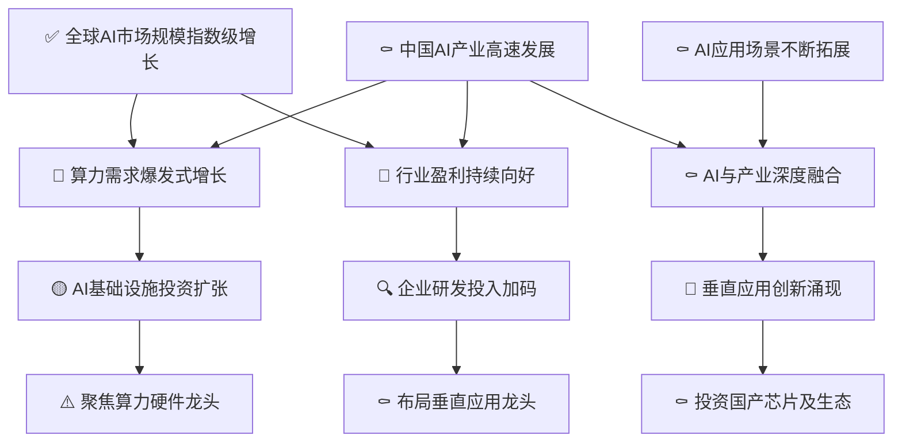

# 人工智能行业景气分析

> **综合评级: ✅ 景气** | 信号强度: 1.50 | 生成日期: 2026-07-08

## 推理链概览

## 📊 现状诊断

### ✅ 全球AI市场规模指数级增长

> **ID**: `H0-1` | 置信度: high
> ⏱️ 时间窗口: 当前

**陈述**: 全球人工智能市场规模从2020年的19141亿元扩大至2024年的45518亿元，复合年增长率24.2%，预计2026年达到76878亿元，呈现指数级增长。

**推理链**: 因为信源[1][3][6]一致确认全球AI投资激增、技术快速进步以及多行业广泛应用，所以全球AI市场规模实现指数级增长，导致整个产业链景气度大幅提升。

**跟踪指标**:
- 全球AI市场规模年度值 (巡检: yearly)
- 全球AI市场年度增长率 (巡检: yearly)

### ⚰️ 中国AI产业高速发展

> **ID**: `H0-2` | 置信度: high
> ⏱️ 时间窗口: 当前

**陈述**: 2024年中国人工智能核心产业规模达9188亿元，同比增长31.1%，预计2026年突破1.7万亿元，增速高于全球平均水平。

**推理链**: 因为信源[1][2][6]指出中国在政策、科研投入和市场需求驱动下，AI产业高速增长，所以中国AI产业处于高速发展期，导致国内AI算力、应用和投资机会大量涌现。

**跟踪指标**:
- 中国AI核心产业规模 (巡检: yearly)
- 中国AI产业同比增长率 (巡检: yearly)

### ⚰️ AI应用场景不断拓展

> **ID**: `H0-3` | 置信度: high
> ⏱️ 时间窗口: 当前

**陈述**: AI已在医疗影像诊断、金融智能客服与投顾、自动驾驶、教育个性化学习等多个行业实现深度应用，应用场景不断拓展。

**推理链**: 因为信源[1][3][7]显示AI技术在医疗、金融、交通、教育等领域的渗透加深，所以AI应用场景不断拓展，导致AI与各产业的深度融合进程加速。

**跟踪指标**:
- AI在各行业应用案例数量 (巡检: quarterly)
- AI应用市场规模占比 (巡检: yearly)

## 🔮 一阶推演

### 🚫 算力需求爆发式增长

> **ID**: `H1-1` | 置信度: low
> 上游: `H0-1` → `H0-2`
> ⏱️ 时间窗口: 当前

**陈述**: 受AI模型规模扩大和应用普及驱动，全球及中国的AI算力需求呈现爆发式增长，算力资源供不应求。

**推理链**: 因为H0-1全球AI市场规模指数级增长和H0-2中国AI产业高速发展，导致大模型训练和推理对算力的需求急剧膨胀，所以算力需求爆发式增长，进而推动AI基础设施投资扩张(H2-1)。

**跟踪指标**:
- 全球AI服务器出货量 (巡检: quarterly)
- 主要云厂商资本开支 (巡检: quarterly)

### 🚫 行业盈利持续向好

> **ID**: `H1-2` | 置信度: low
> 上游: `H0-1` → `H0-2`
> ⏱️ 时间窗口: 当前

**陈述**: 2025年上半年A股102家“人工智能+”公司中83家净利润为正，盈利规模同比增长34.74%，AI行业盈利态势持续向好。

**推理链**: 因为H0-1和H0-2所代表的全球及中国AI市场高速增长，带动企业营收和利润增加，所以行业盈利持续向好，这促使企业进一步加码研发投入(H2-2)。

**跟踪指标**:
- A股AI板块季度净利润总和 (巡检: quarterly)
- AI板块营收增长率 (巡检: quarterly)

### ⚰️ AI与产业深度融合

> **ID**: `H1-3` | 置信度: high
> 上游: `H0-2` → `H0-3`
> ⏱️ 时间窗口: 当前

**陈述**: AI技术在医疗、金融、制造、教育等领域深度嵌入业务流程，实现降本增效和模式创新，与产业融合程度不断提升。

**推理链**: 因为H0-2中国AI产业高速发展和H0-3应用场景不断拓展，使得AI从辅助工具变为核心生产力，所以AI与产业深度融合，导致大量垂直应用创新涌现(H2-3)。

**跟踪指标**:
- AI+行业解决方案签约额 (巡检: quarterly)
- AI赋能企业数占比 (巡检: yearly)

## ⚖️ 二阶推演（矛盾与拐点）

### 🟡 AI基础设施投资扩张

> **ID**: `H2-1` | 置信度: low
> 上游: `H1-1`
> ⏱️ 时间窗口: 当前-2026Q4

**陈述**: 科技巨头和云计算厂商持续加大资本开支，推动AI服务器、数据中心等基础设施建设，投资规模显著扩张。

**推理链**: 因为H1-1算力需求爆发式增长，云服务商和互联网大厂必须扩充基础设施来满足需求，所以AI基础设施投资扩张，进而使得算力硬件龙头的业绩确定性增强(H3-1)。

**跟踪指标**:
- 全球数据中心资本开支总额 (巡检: quarterly)
- 新建数据中心机架数 (巡检: quarterly)

### 🔍 企业研发投入加码

> **ID**: `H2-2` | 置信度: low
> 上游: `H1-2`
> ⏱️ 时间窗口: 当前-2026Q4

**陈述**: 随着行业盈利向好，AI上市公司和初创企业纷纷加大研发投入，加速大模型迭代和应用产品开发。

**推理链**: 因为H1-2行业盈利持续向好，企业拥有更多内源资金和融资渠道，所以研发投入加码，这为垂直应用龙头的技术壁垒和产品优势奠定基础(H3-2)。

**跟踪指标**:
- 人工智能上市公司研发支出总和 (巡检: quarterly)
- AI领域专利授权数量 (巡检: monthly)

### 🚫 垂直应用创新涌现

> **ID**: `H2-3` | 置信度: low
> 上游: `H1-3`
> ⏱️ 时间窗口: 当前-2026Q4

**陈述**: 在AI与产业深度融合背景下，医疗、金融、交通、教育等领域出现大量创新应用方案，垂直市场竞争激烈且创新活跃。

**推理链**: 因为H1-3 AI与产业深度融合，使得各行业痛点被AI重新定义，所以垂直应用创新大量涌现，这为国产芯片及生态提供了丰富的落地场景和需求(H3-3)。

**跟踪指标**:
- AI垂直应用初创企业获投数量 (巡检: monthly)
- 行业SaaS ARR增长率 (巡检: quarterly)

## 🎯 投资落点

### ⚠️ 聚焦算力硬件龙头

> **ID**: `H3-1` | 置信度: medium
> 上游: `H2-1`
> ⏱️ 时间窗口: 当前-2026年

**陈述**: 在AI基础设施投资扩张趋势下，算力硬件龙头厂商将获得确定性订单和营收增长，是当前配置的核心方向。

**推理链**: 因为H2-1 AI基础设施投资扩张，算力芯片、光模块、AI服务器等需求刚性增长，所以应聚焦算力硬件龙头，这些公司业绩能见度高，弹性大。

**跟踪指标**:
- 英伟达数据中心业务营收 (巡检: quarterly)
- 光模块龙头出口数据 (巡检: monthly)

**投资含义**: {'受益环节': 'AI训练/推理芯片、HBM存储、高速光模块、AI服务器ODM、液冷散热。', '典型标的特征': '已进入英伟达、AMD或国内头部互联网公司供应链，单季AI相关营收占比超30%，有明确的产能扩张计划。', '排除特征': '纯概念炒作、无实际批量供货记录、研发投入严重不足的硬件公司。'}

### ⚰️ 布局垂直应用龙头

> **ID**: `H3-2` | 置信度: high
> 上游: `H2-2`
> ⏱️ 时间窗口: 当前-2026年

**陈述**: 随着企业研发投入加码，在AI+医疗、金融、教育等垂直赛道已跑出龙头，商业化落地加快，适合中长期布局。

**推理链**: 因为H2-2企业研发投入加码，推动AI应用产品从项目制向标准化SaaS转型，所以应布局垂直应用龙头，这些公司具备高客户粘性和经常性收入，盈利模式清晰。

**跟踪指标**:
- 垂直应用龙头SaaS订阅收入 (巡检: quarterly)
- 垂直应用客户留存率 (巡检: quarterly)

**投资含义**: {'受益环节': 'AI+医疗影像、AI+金融智能投顾/风控、AI+自动驾驶解决方案、AI+教育个性化学习平台。', '典型标的特征': '在细分领域拥有标杆客户案例，收入增速持续高于30%，毛利率超过50%，标准化产品收入占比提升。', '排除特征': '依赖单一大客户、研发资本化率过高、经营活动现金流持续为负的软件企业。'}

### ⚰️ 投资国产芯片及生态

> **ID**: `H3-3` | 置信度: high
> 上游: `H2-3`
> ⏱️ 时间窗口: 当前-2026年

**陈述**: 垂直应用创新带来的异构算力需求和自主可控政策共振，国产AI芯片及生态面临“客户导入+产能放量”的双重机遇。

**推理链**: 因为H2-3垂直应用创新涌现，对推理算力和特定场景芯片需求增大，加之信创要求，所以投资国产芯片及生态正当其时，将受益于下游应用的量价齐升。

**跟踪指标**:
- 国产AI芯片出货量 (巡检: quarterly)
- 国产芯片生态适配应用数 (巡检: monthly)

**投资含义**: {'受益环节': '国产AI芯片设计（GPU/ASIC）、先进封装、国产EDA/IP、基于国产芯片的AI服务器及软件栈。', '典型标的特征': '芯片已流片成功并得到头部客户测试认证，2026年有明确放量规划，研发人员占比超60%。', '排除特征': '长期停留在PPT阶段、依赖政府补贴、没有实际半导体制造支持的纯设计公司。'}

## 验证总览

| 层级 | ID | 假设 | 状态 | 上游 | 时间窗口 |
|------|-----|------|------|------|------|
| L0 | H0-1 | 全球AI市场规模指数级增长 | ✅ confirmed |  | 当前 |
| L0 | H0-2 | 中国AI产业高速发展 | ⚰️ overturned |  | 当前 |
| L0 | H0-3 | AI应用场景不断拓展 | ⚰️ overturned |  | 当前 |
| L1 | H1-1 | 算力需求爆发式增长 | 🚫 unreachable | H0-1, H0-2 | 当前 |
| L1 | H1-2 | 行业盈利持续向好 | 🚫 unreachable | H0-1, H0-2 | 当前 |
| L1 | H1-3 | AI与产业深度融合 | ⚰️ overturned | H0-2, H0-3 | 当前 |
| L2 | H2-1 | AI基础设施投资扩张 | 🟡 weak_disputed | H1-1 | 当前-2026Q4 |
| L2 | H2-2 | 企业研发投入加码 | 🔍 unverified | H1-2 | 当前-2026Q4 |
| L2 | H2-3 | 垂直应用创新涌现 | 🚫 unreachable | H1-3 | 当前-2026Q4 |
| L3 | H3-1 | 聚焦算力硬件龙头 | ⚠️ partial | H2-1 | 当前-2026年 |
| L3 | H3-2 | 布局垂直应用龙头 | ⚰️ overturned | H2-2 | 当前-2026年 |
| L3 | H3-3 | 投资国产芯片及生态 | ⚰️ overturned | H2-3 | 当前-2026年 |

## 行业股池（共 16 只）

| 排名 | 股票 | 纯度分 | 方向分 | ROE | 毛利率 | 营收增速 | 匹配方向 |
|------|------|--------|--------|-----|--------|----------|----------|
| 1 | 智度股份 | 44.24% | 0.00 | 1.1% | 17.3% | -4.7% | H3-1 |
| 2 | 视觉中国 | 24.95% | 0.00 | 6.4% | 42.4% | -2.2% | H3-1 |
| 3 | 航锦科技 | 21.31% | 0.20 | 0.7% | 10.8% | -30.8% | H3-1 |
| 4 | *ST启环 | 15.34% | 0.00 | nan% | 26.0% | -12.5% | H3-1 |
| 5 | 云鼎科技 | 9.56% | 0.00 | 1.2% | 33.8% | -24.2% | H3-1 |
| 6 | 京东方A | 9.23% | 0.00 | 1.3% | 15.6% | 0.8% | H3-1 |
| 7 | 常山北明 | 7.43% | 0.00 | -1.9% | 9.2% | 6.2% | H3-1 |
| 8 | 贝瑞基因 | 6.59% | 0.00 | -1.3% | 51.5% | -3.5% | H3-1 |
| 9 | 华数传媒 | 4.35% | 0.00 | 0.7% | 29.6% | -4.9% | H3-1 |
| 10 | 建投能源 | 3.23% | 0.00 | 4.6% | 23.0% | -4.7% | H3-1 |
| 11 | 东方电子 | 2.24% | 0.00 | 3.9% | 30.4% | 8.1% | H3-1 |
| 12 | 冰轮环境 | 0.00% | 0.60 | 1.8% | 24.9% | 18.3% | H3-1 |
| 13 | 中兴通讯 | 0.00% | 0.50 | 1.7% | 28.3% | 6.1% | H3-1 |
| 14 | 中国长城 | 0.00% | 0.50 | -0.8% | 18.8% | 12.7% | H3-1 |
| 15 | 特发信息 | 0.00% | 0.50 | -0.9% | 19.2% | 5.1% | H3-1 |
| 16 | 深桑达A | 0.00% | 0.30 | -1.1% | 6.6% | 2.1% | H3-1 |