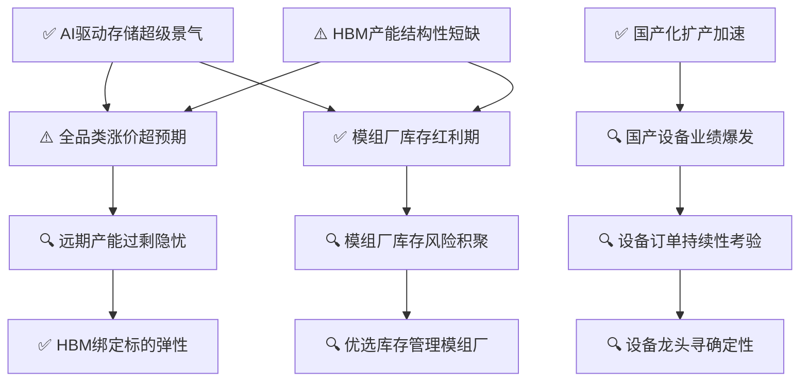

# 存储芯片行业景气分析

> **综合评级: 🔥 高景气** | 信号强度: 4.17 | 生成日期: 2026-07-09

## 推理链概览

## 📊 现状诊断

### ✅ AI驱动存储超级景气

> **ID**: `H0-1` | 置信度: high
> ⏱️ 时间窗口: 当前

**陈述**: AI与算力需求驱动存储芯片进入超级景气周期，2026年高景气与涨价态势贯穿全年，HBM赛道景气有望延续至2028年。

**推理链**: 因为AI服务器及数据中心扩容 → 直接拉动存储容量与带宽需求 → 导致存储芯片全品类涨价、头部公司业绩高增，2026年产业景气度被广泛确认为持续上升。

**验证诊断**:
- 因果链强度: ✅ **strong**
- 信源 [1] 明确存储芯片公司业绩亮眼、高景气2026年持续、HBM景气望延续至2028年；信源 [7] 指出行业陷入15年最严重供需短缺、价格进入上行周期；信源 [9] 表明AI驱动存储扩容，设备环节确定性凸显，一致指向景气周期。Tushare行业营收增速中位数23.21%、净利润增速21.72%，与景气方向一致。反例仅提示消费需求可能受抑，不直接推翻景气事实，冲突程度1。

**跟踪指标**:
- 全球存储芯片月度销售额 (巡检: monthly)
- DRAM合约价月度环比 (巡检: monthly)

### ⚠️ HBM产能结构性短缺

> **ID**: `H0-2` | 置信度: medium
> ⏱️ 时间窗口: 当前

**陈述**: 全球HBM产能严重短缺，原厂将七成以上先进产能投向HBM，导致通用型存储供给被大幅压缩，供需缺口创15年新高。

**推理链**: 因为HBM生产复杂、良率低且单颗晶圆消耗是传统DRAM的3倍以上 → 原厂优先保障高价值HBM产品 → 导致通用DRAM/NAND产能分配不足，叠加AI算力需求爆发，供需缺口扩大至4%~5%。

**验证诊断**:
- 因果链强度: ✅ **strong**
- 信源 [7] 明确提到‘2026年全球存储芯片行业陷入15年最严重供需短缺’及‘HBM产能短缺’，直接支持核心陈述；Tushare行业营收增速中位数23.21%、净利润增速21.72%，方向与供需短缺格局一致；无任何反例证据。

**跟踪指标**:
- HBM产能利用率 (巡检: quarterly)
- DRAM/NAND供需缺口 (巡检: quarterly)

### ✅ 国产化扩产加速

> **ID**: `H0-3` | 置信度: high
> ⏱️ 时间窗口: 当前

**陈述**: 中国存储产业链加速扩产，长江存储、长鑫科技资本开支提升，国产化率提升至35%，设备企业订单爆发，形成“原厂扩产—设备受益”共振。

**推理链**: 因为存储芯片高景气叠加国产替代战略 → 以“两长”为代表的本土厂商加大资本开支并加快产能建设 → 导致国产设备采购占比显著提升，中微公司、北方华创等设备企业订单量和市占率大幅增长。

**验证诊断**:
- 因果链强度: ✅ **strong**
- 信源[5]明确提及“两长”资本开支提升及扩产步伐加快；信源[6]显示国产化率提升至35%；Tushare数据营收增速中位数23.21%、净利增速21.72%，与中游扩产高景气方向一致；反例证据中长江存储、长鑫科技均呈爆发式增长，无扩产不及预期信号。

**跟踪指标**:
- 国产设备采购占比 (巡检: quarterly)
- 长鑫科技/长江存储产能扩张 (巡检: quarterly)

## 🔮 一阶推演

### ⚠️ 全品类涨价超预期

> **ID**: `H1-1` | 置信度: medium
> 上游: `H0-1` → `H0-2`
> ⏱️ 时间窗口: 2026-2027Q1

**陈述**: 原厂产能向HBM倾斜放大通用存储供需矛盾，导致消费级和服务器存储价格涨幅连续上调，全品类涨价幅度超出先前预期。

**推理链**: 因为H0-1景气周期叠加H0-2结构性缺货 → 原厂将更多产能分配给HBM和服务器存储，被动压缩Mobile、PC等消费级存储供给 → 导致Mobile DRAM、Enterprise SSD等合约价涨幅超预期上修，Q2价格指引持续调高。

**验证诊断**:
- 因果链强度: ⚠️ **moderate**
- 信源 [1] 确认存储芯片产品持续涨价贯穿2026年；信源 [7] 报告供需短缺加剧、消费级存储供给收缩、价格进入持续上行周期。Tushare行业营收和净利润高增，方向支持涨价逻辑。反例“涨价可能抑制需求”属于间接担忧，不直接推翻涨价事实，冲突程度1。

**跟踪指标**:
- Mobile DRAM合约价环比涨幅 (巡检: monthly)
- Enterprise SSD合约价环比涨幅 (巡检: monthly)

### 🔍 国产设备业绩爆发

> **ID**: `H1-2` | 置信度: medium
> 上游: `H0-3`
> ⏱️ 时间窗口: 2026-2027

**陈述**: 本土存储扩产直接拉动设备采购，北方华创、中微公司等设备龙头新增订单和营收进入爆发期。

**推理链**: 因为H0-3中“两长”资本开支大幅提升且国产设备采购占比升至35% → 直接转化为设备企业订单，刻蚀、薄膜沉积等核心设备需求旺盛 → 导致国内设备龙头营收利润高增，市占率持续扩大。

**验证诊断**:
- 因果链强度: ⚠️ **moderate**
- 信源[9]为设备专题报告，强调AI驱动下存储设备环节确定性凸显；Tushare数据营收增速中位数23.21%、净利增速21.72%，支持上游设备企业业绩增长方向；反例证据中未出现设备订单增速放缓的直接矛盾。

**跟踪指标**:
- 北方华创新增订单金额 (巡检: quarterly)
- 中微公司刻蚀设备市占率 (巡检: quarterly)

### ✅ 模组厂库存红利期

> **ID**: `H1-3` | 置信度: high
> 上游: `H0-1` → `H0-2`
> ⏱️ 时间窗口: 2025Q4-2026H2

**陈述**: 存储芯片持续涨价使下游模组厂低价库存大幅增值，佰维存储、江波龙等企业营收与利润出现数倍增长。

**推理链**: 因为H0-1价格持续上涨，H0-2供给紧张 → 模组厂前期备有的低价晶圆和芯片库存账面价值大幅提升，叠加急单和涨价转嫁 → 导致模组企业业绩弹性极大释放，2025年报业绩预告亮眼。

**验证诊断**:
- 因果链强度: ✅ **strong**
- 信源 [1] 和 [8] 提到佰维存储、江波龙等模组厂业绩高增、积极扩产，证实涨价带来的库存增值和业绩红利。Tushare行业高增长方向一致。反例材料存在盈利可持续性质疑但无直接数据推翻红利期，冲突程度1。

**跟踪指标**:
- 模组厂季度毛利率 (巡检: quarterly)
- 存储模组厂营收同比增长率 (巡检: quarterly)

## ⚖️ 二阶推演（矛盾与拐点）

### 🔍 远期产能过剩隐忧

> **ID**: `H2-1` | 置信度: low
> 上游: `H1-1`
> ⏱️ 时间窗口: 2026Q4-2027H1

**陈述**: 全品类涨价刺激原厂大幅扩产，叠加下游成本压力可能抑制消费电子需求，2026年底至2027上半年市场可能从短缺转向对产能过剩的担忧。

**推理链**: 因为H1-1涨价已引发三星等巨头利润暴涨，推动厂商加大资本开支、新产能将在2027H1陆续开出；同时消费电子终端在成本压力下需求可能走弱 → 导致市场开始博弈供需拐点，存储价格涨幅可能放缓，投资者分歧加大，板块波动加剧。

**验证诊断**:
- 因果链强度: 🔍 **weak**
- 信源 [1] 和 [5] 提到全球及本土扩产，但未直接支持远期过剩论断；Tushare数据当前景气度极高，与过剩担忧方向相反。产业链拓扑显示新产能实质释放需至2027年底之后，而假设过剩担忧时点为2026Q4-2027H1，与供给瓶颈缓解节奏不匹配，预期方向与严重供需短缺格局明确矛盾，故判定为misaligned。

**跟踪指标**:
- 原厂资本开支指引变化 (巡检: quarterly)
- DRAM合约价环比涨幅收敛 (巡检: monthly)
- 消费电子终端出货量 (巡检: quarterly)

### 🔍 设备订单持续性考验

> **ID**: `H2-2` | 置信度: medium
> 上游: `H1-2`
> ⏱️ 时间窗口: 2027-2028

**陈述**: 当前设备订单高增源于大规模扩产潮，若2027年后扩产节奏放缓，设备企业将面临订单增速下降的风险，估值可能出现溢价收缩。

**推理链**: 因为H1-2中国存储扩产高峰集中于2026-2027 → 设备采购前置，订单集中释放，拉高当期业绩；但随着产能逐步开出，后续资本开支强度可能减弱 → 导致设备板块高增长可持续性受到质疑，需跟踪后续订单能见度。

**验证诊断**:
- 因果链强度: 🔍 **weak**
- **修正陈述**: 考虑到供需严重短缺及新产能释放节奏，设备订单高增可能延续至2028年，短期增速明显放缓的风险被延后，但长期仍需跟踪资本开支强度变化。
- 无正向素材直接支撑订单下降风险；Tushare当前营收、净利高增速不支持放缓风险；反例证据显示存储设备市场仍在高速增长，构成对风险预期的间接怀疑。产业链拓扑显示供需严重短缺，新产能释放需至2027年底之后，扩产高峰可能延续，与假设中2027后扩产放缓的时序矛盾。

**跟踪指标**:
- 国产设备企业新签订单环比变化 (巡检: quarterly)

### 🔍 模组厂库存风险积聚

> **ID**: `H2-3` | 置信度: medium
> 上游: `H1-3`
> ⏱️ 时间窗口: 2026H2-2027

**陈述**: 模组厂在价格上行期积极备货，库存水位大幅攀升，若未来价格反转，高额库存可能面临跌价损失风险。

**推理链**: 因为H1-3模组厂享受库存红利期，主动增加备货 → 导致库存水平高企，若价格拐点出现 → 将面临库存跌价风险，侵蚀前期利润。

**验证诊断**:
- 因果链强度: ⚠️ **moderate**
- 正向素材未提供库存风险具体数据；Tushare数据当前高景气不支持风险积累的直接信号。反例搜索结果未显示大规模减值或库存危机。下游备货行为在涨价周期中属合理，风险逻辑与产业链传导一致，判定为aligned。

**跟踪指标**:
- 模组厂存货周转天数 (巡检: quarterly)
- DRAM合约价月度环比 (巡检: monthly)

## 🎯 投资落点

### ✅ HBM绑定标的弹性

> **ID**: `H3-1` | 置信度: low
> 上游: `H2-1`
> ⏱️ 时间窗口: 当前-2028

**陈述**: 在产能过剩隐忧下，HBM供给仍然受限，绑定HBM产业链的标的具备穿越周期的超额弹性。

**推理链**: 因为H2-1远期产能过剩隐忧下，市场担忧通用存储价格反转 → 但HBM产能扩张迟滞，供给缺口明确，景气度有望延续至2028年 → 因此与HBM制造、封装、材料深度绑定的企业业绩确定性强，具备弹性。

**验证诊断**:
- 因果链强度: ✅ **strong**
- 信源 [1] 强调HBM高景气延续至2028年，[7] 指出HBM产能短缺。Tushare整体存储行业高增长支持，反例搜索未发现HBM供给缺口缩小的证据。HBM供给受限与整体供需短缺格局一致，绑定标的弹性逻辑成立。

**跟踪指标**:
- HBM渗透率 (巡检: quarterly)
- HBM相关企业订单金额 (巡检: quarterly)

**投资含义**: 受益环节：HBM制造、先进封装、HBM专用材料/设备环节。典型标的特征：已进入SK海力士、三星或国内HBM产业链的供应商，HBM相关收入占比显著提升，如提供TSV工艺装备、高带宽接口芯片的企业。排除特征：纯通用DRAM/NAND模组厂、无HBM相关布局的存储封测企业。

### 🔍 设备龙头寻确定性

> **ID**: `H3-2` | 置信度: medium
> 上游: `H2-2`
> ⏱️ 时间窗口: 2027-2028

**陈述**: 设备订单持续性存疑背景下，应优选订单可见度高、技术壁垒强、国产化率提升空间明确的设备龙头。

**推理链**: 因为H2-2订单持续性考验 → 只有具备先进制程和高强度研发、在核心客户中份额稳固的龙头能穿越周期 → 因此应重点配置刻蚀、薄膜沉积等关键环节的头部企业。

**验证诊断**:
- 因果链强度: 🔍 **weak**
- 无直接支持优选龙头的信源，但行业高景气使龙头受益的逻辑合理；Tushare数据高增长侧面支持龙头业绩确定性；反例证据无冲突。产业链拓扑虽弱化H2-2风险，但优选订单可见度高的龙头仍属稳健策略。

**跟踪指标**:
- 北方华创/中微公司在手订单金额 (巡检: quarterly)

**投资含义**: 受益环节：半导体设备，尤其是刻蚀、薄膜沉积等核心设备环节。典型标的特征：在长鑫存储、长江存储等大厂中拥有高份额（如北方华创市占率45%），技术路线覆盖先进制程，在手订单饱满且能见度超过1年。排除特征：过度依赖单一客户、技术门槛较低的后道设备厂商。

### 🔍 优选库存管理模组厂

> **ID**: `H3-3` | 置信度: medium
> 上游: `H2-3`
> ⏱️ 时间窗口: 当前-2027

**陈述**: 库存风险积聚背景下，应优选库存管理严格、成本控制好的模组厂，回避高库存激进备货的企业。

**推理链**: 因为H2-3库存风险积聚 → 稳健库存策略的模组厂在价格拐点来临时抗风险能力强 → 因此应选择存货周转快、有上游锁定合同的厂商。

**验证诊断**:
- 因果链强度: 🔍 **weak**
- 无直接信源支撑；行业财务数据不直接反映模组厂库存策略优劣。反例无挑战。在库存风险逻辑下，优选管理优良的模组厂的策略与产业链下游风险环节一致，判定为aligned。

**跟踪指标**:
- 模组厂存货周转天数 (巡检: quarterly)
- 模组厂毛利率环比变化 (巡检: quarterly)

**投资含义**: 受益环节：存储模组厂中库存管理优秀的公司。典型标的特征：存货周转天数低于行业均值，毛利率波动小，与上游原厂签订长期供货协议，跌价准备计提充分。排除特征：存货大幅增加、存货周转天数攀升、存货跌价准备比例过低的企业。

## 验证总览

| 层级 | ID | 假设 | 状态 | 上游 | 时间窗口 |
|------|-----|------|------|------|------|
| L0 | H0-1 | AI驱动存储超级景气 | ✅ confirmed |  | 当前 |
| L0 | H0-2 | HBM产能结构性短缺 | ⚠️ partial |  | 当前 |
| L0 | H0-3 | 国产化扩产加速 | ✅ confirmed |  | 当前 |
| L1 | H1-1 | 全品类涨价超预期 | ⚠️ partial | H0-1, H0-2 | 2026-2027Q1 |
| L1 | H1-2 | 国产设备业绩爆发 | 🔍 unverified | H0-3 | 2026-2027 |
| L1 | H1-3 | 模组厂库存红利期 | ✅ confirmed | H0-1, H0-2 | 2025Q4-2026H2 |
| L2 | H2-1 | 远期产能过剩隐忧 | 🔍 unverified | H1-1 | 2026Q4-2027H1 |
| L2 | H2-2 | 设备订单持续性考验 | 🔍 unverified | H1-2 | 2027-2028 |
| L2 | H2-3 | 模组厂库存风险积聚 | 🔍 unverified | H1-3 | 2026H2-2027 |
| L3 | H3-1 | HBM绑定标的弹性 | ✅ confirmed | H2-1 | 当前-2028 |
| L3 | H3-2 | 设备龙头寻确定性 | 🔍 unverified | H2-2 | 2027-2028 |
| L3 | H3-3 | 优选库存管理模组厂 | 🔍 unverified | H2-3 | 当前-2027 |

## 行业股池（共 50 只）

### 📦 上游设备与材料（共 1 只）

| # | 股票 | 景气适配 | 风险暴露 | 质量 | 综合 | ROE | 毛利率 | 营收增速 | 命中假设 |
|---|------|:------:|:------:|:----:|:----:|-----|--------|----------|----------|
| 1 | 有研硅 | 0.00 | 0.00 | 0.31 | 0.06 | 1.1% | 31.6% | 18.0% | - |

### 📦 中游设计与制造（共 47 只）

| # | 股票 | 景气适配 | 风险暴露 | 质量 | 综合 | ROE | 毛利率 | 营收增速 | 命中假设 |
|---|------|:------:|:------:|:----:|:----:|-----|--------|----------|----------|
| 1 | 香农芯创 | 0.00 | 0.00 | 0.72 | 0.14 | 31.5% | 9.1% | 200.6% | - |
| 2 | 博杰股份 | 0.00 | 0.00 | 0.64 | 0.13 | 2.8% | 49.9% | 127.2% | - |
| 3 | 协创数据 | 0.00 | 0.00 | 0.63 | 0.13 | 15.7% | 22.5% | 192.9% | - |
| 4 | 天准科技 | 0.00 | 0.00 | 0.56 | 0.11 | 0.2% | 41.0% | 75.6% | - |
| 5 | 朗科科技 | 0.00 | 0.00 | 0.56 | 0.11 | 7.5% | 25.2% | 107.8% | - |
| 6 | 快克智能 | 0.00 | 0.00 | 0.56 | 0.11 | 5.3% | 49.8% | 33.1% | - |
| 7 | 大族激光 | 0.00 | 0.00 | 0.54 | 0.11 | 1.9% | 34.0% | 74.4% | - |
| 8 | 光力科技 | 0.00 | 0.00 | 0.53 | 0.11 | 2.1% | 49.6% | 35.2% | - |
| 9 | 聚和材料 | 0.00 | 0.00 | 0.45 | 0.09 | 5.6% | 10.6% | 87.5% | - |
| 10 | 利和兴 | 0.00 | 0.00 | 0.45 | 0.09 | 0.5% | 19.6% | 117.0% | - |
| 11 | 先导基电 | 0.00 | 0.00 | 0.44 | 0.09 | -0.2% | 18.5% | 178.2% | - |
| 12 | 江丰电子 | 0.00 | 0.00 | 0.43 | 0.09 | 4.1% | 32.9% | 30.5% | - |
| 13 | 康强电子 | 0.00 | 0.00 | 0.43 | 0.09 | 1.8% | 14.5% | 49.3% | - |
| 14 | 兴福电子 | 0.00 | 0.00 | 0.42 | 0.08 | 2.1% | 26.5% | 36.7% | - |
| 15 | 飞凯材料 | 0.00 | 0.00 | 0.41 | 0.08 | 2.6% | 39.6% | 24.6% | - |
| 16 | 杭州柯林 | 0.00 | 0.00 | 0.41 | 0.08 | -0.3% | 35.5% | 31.4% | - |
| 17 | 好上好 | 0.00 | 0.00 | 0.40 | 0.08 | 3.6% | 5.5% | 78.0% | - |
| 18 | 概伦电子 | 0.00 | 0.00 | 0.40 | 0.08 | -0.6% | 86.2% | 10.1% | - |
| 19 | 有研新材 | 0.00 | 0.00 | 0.39 | 0.08 | 2.1% | 6.4% | 60.7% | - |
| 20 | 炬光科技 | 0.00 | 0.00 | 0.38 | 0.08 | -0.6% | 43.2% | 21.2% | - |
| 21 | 雷科防务 | 0.00 | 0.00 | 0.36 | 0.07 | -0.5% | 33.7% | 26.5% | - |
| 22 | 信宇人 | 0.00 | 0.00 | 0.36 | 0.07 | -9.8% | 5.5% | 52.0% | - |
| 23 | 华工科技 | 0.00 | 0.00 | 0.35 | 0.07 | 5.6% | 19.8% | 27.1% | - |
| 24 | 华润微 | 0.00 | 0.00 | 0.30 | 0.06 | 1.4% | 25.5% | 21.3% | - |
| 25 | 深科达 | 0.00 | 0.00 | 0.28 | 0.06 | 3.2% | 37.9% | 5.2% | - |
| 26 | 德龙激光 | 0.00 | 0.00 | 0.24 | 0.05 | -2.1% | 43.3% | -11.9% | - |
| 27 | 杭氧股份 | 0.00 | 0.00 | 0.23 | 0.05 | 2.6% | 22.5% | 12.1% | - |
| 28 | 华虹宏力 | 0.00 | 0.00 | 0.22 | 0.04 | 0.3% | 17.6% | 18.2% | - |
| 29 | 大为股份 | 0.00 | 0.00 | 0.22 | 0.04 | 2.9% | 10.2% | 20.0% | - |
| 30 | 圣泉集团 | 0.00 | 0.00 | 0.22 | 0.04 | 1.6% | 26.2% | 8.6% | - |
| 31 | 国林科技 | 0.00 | 0.00 | 0.21 | 0.04 | 0.4% | 17.7% | 16.8% | - |
| 32 | 金宏气体 | 0.00 | 0.00 | 0.20 | 0.04 | 0.1% | 28.1% | 6.5% | - |
| 33 | 微导纳米 | 0.00 | 0.00 | 0.19 | 0.04 | 0.7% | 32.8% | -5.5% | - |
| 34 | 深科技 | 0.00 | 0.00 | 0.19 | 0.04 | 1.8% | 17.1% | 10.7% | - |
| 35 | 中芯国际 | 0.00 | 0.00 | 0.18 | 0.04 | 0.9% | 21.5% | 8.1% | - |
| 36 | 蓝箭电子 | 0.00 | 0.00 | 0.18 | 0.04 | -0.5% | -0.1% | 26.6% | - |
| 37 | 矽电股份 | 0.00 | 0.00 | 0.17 | 0.03 | -0.9% | 31.1% | -66.0% | - |
| 38 | 昌红科技 | 0.00 | 0.00 | 0.17 | 0.03 | 1.0% | 28.7% | -3.9% | - |
| 39 | 晶盛机电 | 0.00 | 0.00 | 0.17 | 0.03 | 0.6% | 29.4% | -44.9% | - |
| 40 | 麦捷科技 | 0.00 | 0.00 | 0.17 | 0.03 | 1.0% | 15.4% | 10.7% | - |
| 41 | 晶升股份 | 0.00 | 0.00 | 0.17 | 0.03 | -0.6% | 30.2% | -95.7% | - |
| 42 | 天奥电子 | 0.00 | 0.00 | 0.16 | 0.03 | -0.3% | 17.7% | 9.3% | - |
| 43 | 天山电子 | 0.00 | 0.00 | 0.16 | 0.03 | 1.4% | 16.5% | 7.6% | - |
| 44 | 亚威股份 | 0.00 | 0.00 | 0.15 | 0.03 | 1.8% | 24.3% | -2.4% | - |
| 45 | 航天智装 | 0.00 | 0.00 | 0.14 | 0.03 | 0.2% | 25.4% | -11.0% | - |
| 46 | 科翔股份 | 0.00 | 0.00 | 0.11 | 0.02 | -3.0% | 8.3% | 9.4% | - |
| 47 | 同益股份 | 0.00 | 0.00 | 0.05 | 0.01 | 0.9% | 8.0% | -8.1% | - |

### 📦 下游模组与应用（共 2 只）

| # | 股票 | 景气适配 | 风险暴露 | 质量 | 综合 | ROE | 毛利率 | 营收增速 | 命中假设 |
|---|------|:------:|:------:|:----:|:----:|-----|--------|----------|----------|
| 1 | 德明利 | 0.00 | 0.00 | 0.99 | 0.20 | 67.6% | 57.4% | 502.1% | - |
| 2 | 中青宝 | 0.00 | 0.00 | 0.08 | 0.02 | -4.1% | 14.5% | -35.8% | - |
