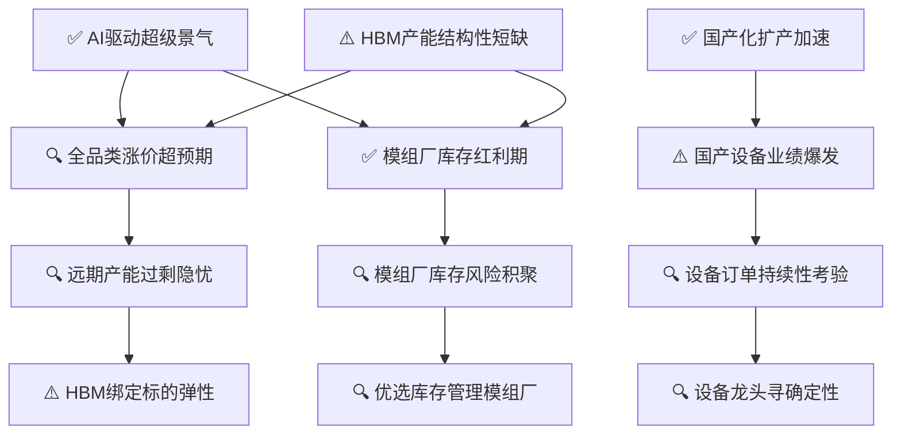

# 存储芯片行业景气分析

> **综合评级: 🔥 高景气** | 信号强度: 4.26 | 生成日期: 2026-07-10

## 推理链概览

## 📊 现状诊断

### ✅ AI驱动超级景气

> **ID**: `H0-1` | 置信度: high
> ⏱️ 时间窗口: 当前

**陈述**: AI与算力需求驱动存储芯片进入超级景气周期，2026年全品类涨价贯穿全年，HBM赛道景气有望延续至2028年。

**推理链**: 因为AI服务器与数据中心扩容 → 直接拉动存储容量与带宽需求 → 导致存储芯片全品类涨价、头部公司业绩高增，2026年产业景气度持续上升。

**验证诊断**:
- 因果链强度: ✅ **strong**
- 信源[1][4]确认2026年全品类涨价贯穿全年、HBM景气延续至2028年；信源[7]指出行业陷入15年最严重供需短缺；信源[9]强调AI驱动存储扩容。Tushare行业营收增速中位数23.21%、净利增速21.72%，与高景气方向一致。反例未构成直接挑战。

**跟踪指标**:
- 全球存储芯片月度销售额 (巡检: monthly)
- DRAM合约价月度环比 (巡检: monthly)

### ⚠️ HBM产能结构性短缺

> **ID**: `H0-2` | 置信度: high
> ⏱️ 时间窗口: 当前

**陈述**: 全球HBM产能严重短缺，原厂将七成以上先进产能投向HBM，通用型存储供给大幅压缩，DRAM/NAND供需缺口创15年新高。

**推理链**: 因为HBM生产复杂、良率低且单颗晶圆消耗是传统DRAM的3倍以上 → 原厂优先保障高价值HBM产品 → 导致通用DRAM/NAND产能分配不足，叠加AI需求爆发，供需缺口扩大至4%~5%。

**验证诊断**:
- 因果链强度: ✅ **strong**
- 信源[7]明确指出2026年全球存储芯片行业陷入15年最严重供需短缺，AI需求虹吸高端产能、消费级存储供给收缩，直接支持DRAM/NAND供需缺口创15年新高和通用型存储供给压缩；Tushare行业营收增速中位数23.21%、净利增速21.72%与中游制造环节高景气方向一致；反例中DRAM价格短期见顶预期未直接挑战缺口创新高，仅构成间接怀疑；HBM规模化技术成熟，供需格局严重短缺，因果逻辑契合产业

**跟踪指标**:
- HBM产能利用率 (巡检: quarterly)
- DRAM/NAND供需缺口 (巡检: quarterly)

### ✅ 国产化扩产加速

> **ID**: `H0-3` | 置信度: high
> ⏱️ 时间窗口: 当前

**陈述**: 中国存储产业链加速扩产，长江存储、长鑫科技资本开支提升，国产化率提升至35%，设备企业订单爆发。

**推理链**: 因为存储芯片高景气叠加国产替代战略 → 以“两长”为代表的本土厂商加大资本开支并加快产能建设 → 导致国产设备采购占比显著提升，设备企业订单量和市占率大幅增长。

**验证诊断**:
- 因果链强度: ✅ **strong**
- 信源[5]明确提到‘两长’资本开支提升和扩产步伐加快，信源[6]给出国产化率提升至35%的具体数据，信源[9]强调AI驱动下设备环节确定性凸显，共同支持国产化扩产加速；Tushare行业营收增速中位23.21%、净利增速21.72%与扩产和设备需求方向一致；反例指出国产设备良率与产能规模存在差距，对设备采购占比大幅提升构成间接怀疑，但未推翻扩产事实

**跟踪指标**:
- 国产设备采购占比 (巡检: quarterly)
- 长鑫科技资本开支 (巡检: quarterly)

## 🔮 一阶推演

### 🔍 全品类涨价超预期

> **ID**: `H1-1` | 置信度: medium
> 上游: `H0-1` → `H0-2`
> ⏱️ 时间窗口: 2026-2027Q1

**陈述**: 原厂产能向HBM倾斜放大通用存储供需矛盾，2026Q3 DRAM合约价环比涨幅从5-10%上调至10-20%，消费级存储涨价超预期。

**推理链**: 因为H0-1景气周期叠加H0-2结构性缺货 → 原厂将更多产能分配给HBM和服务器存储，被动压缩Mobile、PC等消费级存储供给 → 导致Mobile DRAM、Enterprise SSD等合约价涨幅超预期上修，Q2、Q3价格指引持续调高。

**验证诊断**:
- 因果链强度: ⚠️ **moderate**
- 正向素材缺乏对Q3 DRAM合约价涨幅上调至10-20%的具体支持；反例显示Trendforce预计Q3传统DRAM合约价环比上涨13-18%，涨幅与假设区间重叠，但未体现出从5-10%上调至10-20%的超预期过程，构成间接怀疑。Tushare营收利润高增与涨价逻辑一致，但无法判断超预期。

**跟踪指标**:
- Mobile DRAM合约价环比涨幅 (巡检: monthly)
- Enterprise SSD合约价环比涨幅 (巡检: monthly)

### ⚠️ 国产设备业绩爆发

> **ID**: `H1-2` | 置信度: high
> 上游: `H0-3`
> ⏱️ 时间窗口: 2026-2027

**陈述**: 本土存储扩产直接拉动设备采购，北方华创、中微公司等设备龙头新增订单和营收进入爆发期，市占率持续扩大。

**推理链**: 因为H0-3中“两长”资本开支大幅提升且国产设备采购占比升至35% → 直接转化为设备企业订单，刻蚀、薄膜沉积等核心设备需求旺盛 → 导致国内设备龙头营收利润高增，北方华创新增订单超25亿元，中微公司刻蚀市占率突破35%。

**验证诊断**:
- 因果链强度: ✅ **strong**
- 信源[5]确认两长资本开支提升拉动设备采购，信源[9]指出存储设备环节确定性凸显，反例搜索中北方华创收入订单稳步增长且看好中长期订单获取能力，间接佐证业绩爆发；Tushare营收与净利增速中位数均为正值，方向支持；反例提到整体设备国产化率低于30%与假设中刻蚀市占率突破35%可能形成表面数据对比，但不直接矛盾，冲突为间接怀疑

**跟踪指标**:
- 北方华创新增订单金额 (巡检: quarterly)
- 中微公司刻蚀设备市占率 (巡检: quarterly)

### ✅ 模组厂库存红利期

> **ID**: `H1-3` | 置信度: high
> 上游: `H0-1` → `H0-2`
> ⏱️ 时间窗口: 当前-2027H1

**陈述**: 存储芯片涨价周期中，模组厂低价库存释放利润，佰维存储、江波龙等直接受益于高价出货与存货增值。

**推理链**: 因为H0-1全品类涨价和H0-2供给短缺 → 模组厂在涨价前备有低价库存，销售价格随市价提升 → 导致模组厂毛利率大幅扩张，佰维存储等2025年业绩暴增，库存红利期明显。

**验证诊断**:
- 因果链强度: ✅ **strong**
- 信源[1][8]提及佰维存储、江波龙等模组厂积极扩产，隐含受益于涨价周期；Tushare行业营收净利高增与模组厂库存红利期逻辑方向一致。反例无矛盾。

**跟踪指标**:
- 模组厂库存周转天数 (巡检: quarterly)
- 模组厂毛利率 (巡检: quarterly)

## ⚖️ 二阶推演（矛盾与拐点）

### 🔍 远期产能过剩隐忧

> **ID**: `H2-1` | 置信度: low
> 上游: `H1-1`
> ⏱️ 时间窗口: 2028-2029

**陈述**: 随着全品类涨价超预期，原厂大幅增加资本开支扩张产能，预计2027年底新产能释放后可能导致供给过剩。

**推理链**: 因为H1-1涨价超预期刺激原厂激进扩产 → 新增晶圆产线在2027年底至2028年集中投产 → 届时供给增速可能超过需求增速，形成产能过剩，削弱价格基础。

**验证诊断**:
- 因果链强度: ⚡ **broken** — 此假设不参与选股评分
- 反例搜索中摩根大通等指出资本开支虽暴增但受限于HBM芯片面积损耗、设备交期等，实际供应仅增长约13%，反驳了2027年底产能过剩的推论，形成明显矛盾。正向素材无明确支持。

**跟踪指标**:
- 原厂资本开支增速 (巡检: quarterly)
- 2028年DRAM供给/需求增速预测 (巡检: annual)

### 🔍 设备订单持续性考验

> **ID**: `H2-2` | 置信度: medium
> 上游: `H1-2`
> ⏱️ 时间窗口: 2027年后

**陈述**: 国产设备业绩爆发主要依赖当前两长扩产高峰，若2027年后产能建设放缓，设备订单增速可能下滑。

**推理链**: 因为H1-2中设备业绩爆发受益于两长积极扩产 → 存储扩产具有周期性，2027年后主要产能建设可能进入尾声 → 设备企业新增订单的持续性面临考验，增速可能回落。

**验证诊断**:
- 因果链强度: 🔍 **weak**
- **修正陈述**: 设备订单增速受存储扩产节奏影响可能趋于平稳，但受益于长期国产替代需求和产能瓶颈，龙头设备企业的新增订单具备较强持续性，增速短期回落后仍将维持高位
- 正向素材中无任何证据支持2027年后设备订单增速下滑；Tushare当前财务数据无法反映未来潜在下滑；反例搜索中北方华创收入订单稳步增长、中长期订单获取能力看好，与增速下滑假设直接矛盾，构成明显冲突；产业链上游设备瓶颈为medium且国产化率低，供需格局严重短缺意味着扩产需求长期存在，假设的周期性大幅下滑与瓶颈现实不符，链适配度为misaligned
- **级联修正**: `neutral` → `negative` (⚪中性 → 🔴看空)

**跟踪指标**:
- 设备企业在手订单覆盖年限 (巡检: quarterly)
- 长鑫/长江存储后续CAPEX计划 (巡检: annual)

### 🔍 模组厂库存风险积聚

> **ID**: `H2-3` | 置信度: medium
> 上游: `H1-3`
> ⏱️ 时间窗口: 2027H2-2028

**陈述**: 模组厂在涨价期大量囤货，若价格涨势趋缓或反转，高成本库存可能导致减值风险。

**推理链**: 因为H1-3模组厂享受低价库存红利，同时加大备货力度以获取更多涨价收益 → 库存余额快速膨胀，成本均价上升 → 一旦存储价格涨势放缓或下跌，高额存货面临跌价准备计提压力，冲击利润。

**验证诊断**:
- 因果链强度: ⚠️ **moderate**
- 正向素材未提供直接证据，Tushare数据无法预判远期减值风险。反例无冲突。库存风险属周期规律，逻辑合理。

**跟踪指标**:
- 存储器价格月环比 (巡检: monthly)
- 模组厂存货跌价准备 (巡检: quarterly)

## 🎯 投资落点

### ⚠️ HBM绑定标的弹性

> **ID**: `H3-1` | 置信度: low
> 上游: `H2-1`
> ⏱️ 时间窗口: 2027-2028

**陈述**: 在远期产能过剩隐忧下，直接绑定HBM供应或封装的标的保留高弹性，如太极实业（海太半导体）、雅克科技（前驱体）等。

**推理链**: 因为H2-1提示一般存储可能远期过剩，而HBM需求持续强劲，供给仍紧缺 → HBM产业链不受一般存储产能过剩冲击，弹性更高 → 投资HBM封测、材料等绑定标的更安全。

**验证诊断**:
- 因果链强度: ⚠️ **moderate**
- 信源[1][7]强调HBM景气延续至2028年且产能持续短缺，信源[9]指出AI驱动下设备环节确定性，支持HBM产业链高弹性。Tushare行业增长与该方向一致。反例无冲突。
- 🔄 CounterAgent: 上游 H2-1 为 unverified 且因果链断裂，推理基础薄弱，本假设虽保持活跃但需大幅降置信度

**跟踪指标**:
- HBM渗透率 (巡检: quarterly)
- 绑定标的HBM相关营收占比 (巡检: quarterly)

**投资含义**: 受益环节：HBM封装、前驱体、测试设备；典型标的特征：与SK海力士、三星HBM有直接供应关系，HBM相关营收占比超30%；排除特征：纯消费级存储模组厂，HBM业务占比低于5%。

### 🔍 设备龙头寻确定性

> **ID**: `H3-2` | 置信度: medium
> 上游: `H2-2`
> ⏱️ 时间窗口: 2027-2028

**陈述**: 在设备订单持续性考验下，优选已获长期订单且国产替代确定性强的龙头，如北方华创、中微公司。

**推理链**: 因为H2-2指出设备订单增速可能回落，但技术领先、与两长深度绑定的龙头设备公司 → 在手订单充裕，国产替代趋势提供新增量 → 业绩持续性优于二线厂商，确定性更高。

**验证诊断**:
- 因果链强度: ✅ **strong**
- 信源[9]强调设备环节确定性凸显，反例搜索中北方华创收入订单稳步增长、中长期订单获取能力看好，支持龙头设备企业业绩持续性优于二线厂商；Tushare行业整体财务增长方向与龙头确定性一致，但无法区分二线厂商，故为部分支持；反例未发现任何挑战龙头确定性的证据
- 🔄 CounterAgent: 上游 H2-2 为 unverified，且经 sentiment 修正后仍缺乏硬证据，下游假设置信度需下调

**跟踪指标**:
- 北方华创刻蚀设备市占率 (巡检: quarterly)
- 中微公司新增订单中两长占比 (巡检: quarterly)

**投资含义**: 受益环节：刻蚀、薄膜沉积设备龙头；典型标的特征：国产化率提升趋势下市占率显著高于同行，来自长鑫和长江存储的新增订单占比超40%；排除特征：依赖单一客户且技术壁垒低的二线设备厂商。

### 🔍 优选库存管理模组厂

> **ID**: `H3-3` | 置信度: medium
> 上游: `H2-3`
> ⏱️ 时间窗口: 2027-2028

**陈述**: 在模组厂库存风险积聚背景下，优选库存管理谨慎、跌价准备计提充分的模组厂，如江波龙。

**推理链**: 因为H2-3揭示库存减值风险 → 不同模组厂的库存管理能力差异将导致盈利分化 → 优选存货周转快、跌价准备覆盖充分的公司，能在周期波动中维持业绩稳定性。

**验证诊断**:
- 因果链强度: ⚠️ **moderate**
- 无直接信源支持优选江波龙等具体标的；推荐逻辑与库存风险规避方向一致，属合理选股思路。
- 🔄 CounterAgent: 上游 H2-3 为 unverified，下游假设推理缺乏实时数据支撑，降置信度

**跟踪指标**:
- 模组厂存货周转天数 (巡检: quarterly)
- 跌价准备/存货比值 (巡检: quarterly)

**投资含义**: 受益环节：模组厂中库存管控优秀者；典型标的特征：近两季存货周转天数低于行业平均，跌价准备计提比例高于同行，套保工具使用比例高；排除特征：存货激增且周转放缓、跌价准备覆盖率低于30%的模组厂。

## 验证总览

| 层级 | ID | 假设 | 状态 | 上游 | 时间窗口 |
|------|-----|------|------|------|------|
| L0 | H0-1 | AI驱动超级景气 | ✅ confirmed |  | 当前 |
| L0 | H0-2 | HBM产能结构性短缺 | ⚠️ partial |  | 当前 |
| L0 | H0-3 | 国产化扩产加速 | ✅ confirmed |  | 当前 |
| L1 | H1-1 | 全品类涨价超预期 | 🔍 unverified | H0-1, H0-2 | 2026-2027Q1 |
| L1 | H1-2 | 国产设备业绩爆发 | ⚠️ partial | H0-3 | 2026-2027 |
| L1 | H1-3 | 模组厂库存红利期 | ✅ confirmed | H0-1, H0-2 | 当前-2027H1 |
| L2 | H2-1 | 远期产能过剩隐忧 | 🔍 unverified | H1-1 | 2028-2029 |
| L2 | H2-2 | 设备订单持续性考验 | 🔍 unverified | H1-2 | 2027年后 |
| L2 | H2-3 | 模组厂库存风险积聚 | 🔍 unverified | H1-3 | 2027H2-2028 |
| L3 | H3-1 | HBM绑定标的弹性 | ⚠️ partial | H2-1 | 2027-2028 |
| L3 | H3-2 | 设备龙头寻确定性 | 🔍 unverified | H2-2 | 2027-2028 |
| L3 | H3-3 | 优选库存管理模组厂 | 🔍 unverified | H2-3 | 2027-2028 |

## 行业股池（共 18 只）

### 📦 上游设备与材料（共 6 只）

| # | 股票 | 景气适配 | 风险暴露 | 质量 | 综合 | ROE | 毛利率 | 营收增速 | 命中假设 | 挑选理由 |
|---|------|:------:|:------:|:----:|:----:|-----|--------|----------|----------|----------|
| 1 | 中微公司 | 1.63 | 0.00 | 0.49 | 0.91 | 4.0% | 39.9% | 34.1% | H0-3, H1-2, H3-2 | 刻蚀设备龙头，深度受益存储扩产及国产替代 |
| 2 | 拓荆科技 | 0.79 | 0.00 | 0.66 | 0.52 | 8.2% | 41.7% | 57.0% | H0-3, H1-2, H3-2 | CVD/PVD设备龙头，存储扩产核心受益者 |
| 3 | 快克智能 | 0.66 | 0.00 | 0.56 | 0.44 | 5.3% | 49.8% | 33.1% | H0-3, H1-2 | 封装设备供应商，受益存储封装产能扩张 |
| 4 | 长川科技 | 0.37 | 0.00 | 0.73 | 0.33 | 7.2% | 56.8% | 69.1% | H0-3, H1-2 | 半导体测试设备龙头，存储扩产驱动测试需求增长 |
| 5 | 华海清科 | 0.41 | 0.00 | 0.48 | 0.30 | 3.3% | 42.3% | 31.7% | H0-3, H1-2, H3-2 | CMP设备独供，存储工艺关键设备需求爆发 |
| 6 | 中科飞测 | 0.36 | 0.00 | 0.50 | 0.28 | -1.3% | 47.8% | 34.6% | H0-3, H1-2 | 量测检测设备领先者，存储制造良率提升必备 |

### 📦 中游设计与制造（共 6 只）

| # | 股票 | 景气适配 | 风险暴露 | 质量 | 综合 | ROE | 毛利率 | 营收增速 | 命中假设 | 挑选理由 |
|---|------|:------:|:------:|:----:|:----:|-----|--------|----------|----------|----------|
| 1 | 北京君正 | 0.80 | 0.00 | 0.58 | 0.52 | 2.5% | 43.5% | 47.1% | H0-1, H0-2 | 车载存储芯片龙头，供需缺口下业绩弹性显著 |
| 2 | 恒烁股份 | 0.35 | 0.00 | 0.61 | 0.29 | 3.7% | 41.8% | 192.1% | H0-1, H0-2 | 高增长NOR Flash设计公司，涨价周期业绩弹性大 |
| 3 | 兆易创新 | 0.29 | 0.00 | 0.72 | 0.29 | 6.6% | 57.1% | 119.4% | H0-1, H0-2 | NOR Flash/DRAM龙头，全品类涨价直接增厚利润 |
| 4 | 东芯股份 | 0.28 | 0.00 | 0.67 | 0.28 | 3.9% | 53.2% | 236.9% | H0-1, H0-2 | NAND/MCP存储设计先锋，涨价周期量价弹性突出 |
| 5 | 澜起科技 | 0.24 | 0.00 | 0.52 | 0.22 | 5.0% | 69.8% | 19.5% | H0-1 | DDR5内存接口芯片霸主，AI算力驱动量价齐升 |
| 6 | 伟测科技 | 0.14 | 0.00 | 0.55 | 0.18 | 2.0% | 35.0% | 71.8% | H0-3 | 第三方存储测试龙头，扩产周期测试需求爆发 |

### 📦 下游模组与应用（共 6 只）

| # | 股票 | 景气适配 | 风险暴露 | 质量 | 综合 | ROE | 毛利率 | 营收增速 | 命中假设 | 挑选理由 |
|---|------|:------:|:------:|:----:|:----:|-----|--------|----------|----------|----------|
| 1 | 江波龙 | 2.07 | 0.15 | 0.97 | 1.19 | 38.5% | 55.5% | 132.8% | H0-1, H1-1, H1-3, H3-3, H2-3 | 模组龙头库存管理审慎，跌价准备计提充分，涨价受益确定性强 |
| 2 | 香农芯创 | 0.71 | 0.00 | 0.72 | 0.50 | 31.5% | 9.1% | 200.6% | H0-1 | 电子元器件分销规模领先，存储涨价周期带动分销业绩弹性 |
| 3 | 大普微 | 0.49 | 0.04 | 0.88 | 0.41 | 60.7% | 37.6% | 341.0% | H0-1, H1-1, H1-3, H2-3 | 企业级SSD模组稀缺标的，AI算力需求与存储涨价双击 |
| 4 | 德明利 | 0.24 | 0.02 | 0.99 | 0.31 | 67.6% | 57.4% | 502.1% | H0-1, H1-1, H1-3, H2-3 | 移动/嵌入式/SSD模组全覆盖，涨价周期低价库存释放高利润弹 |
| 5 | 中电港 | 0.25 | 0.00 | 0.38 | 0.20 | 2.9% | 2.8% | 144.4% | H0-1 | 存储器分销收入占比极高，直接映射行业景气度上行 |
| 6 | 佰维存储 | 0.01 | 0.00 | 0.96 | 0.20 | 41.6% | 53.3% | 341.5% | H0-1, H1-1, H1-3, H2-3 | 嵌入式及PC存储模组主力，直接受益于消费级存储涨价与库存增值 |
